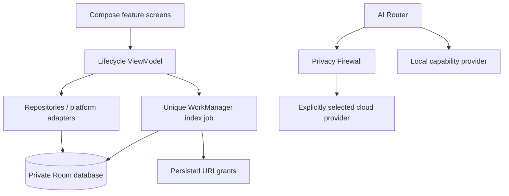

# KANO architecture

## Recovery — 2026-09-29
Existing project recovered at 7774400 (origin/main verified). The seven supplied mobile
references replace earlier visual guidance. See KANO_STATE.md for source-verified audit.

## Implementation decision
Kotlin + Compose + Navigation Compose + Room + WorkManager; minimum API 26, initial
compile/target API 35. These are pinned, known-compatible baseline versions, not a claim
to use the newest releases. Re-evaluate target API and store requirements before release.
Version 0.1.0-dev is a foundation checkpoint, not Kano 1.0.

Two actual modules initially: `core` for Android-free policies and provider contracts;
`app` for composition, UI, Room, and platform adapters. Device/media feature packages
grow into modules when they need independent ownership. No empty Life modules.

AI is an optional dependency of feature use cases, not a mandatory hop for device metrics.
All external providers eventually share a reviewed egress boundary. No cloud provider,
HTTP client, API credential, or Internet permission is installed now. Core provider interfaces
support reason, image, summary, classify, research, extract; current request policy is
text-only. Image requests need a separate inspected payload type before implementation.
Provider-specific implementations must not be exposed directly to UI or workers.

## Data and jobs
Media rows are keyed by URI and retain display name, type, size, source timestamp,
index state, indexed timestamp, optional SHA-256, and a non-sensitive error code.
Initial metadata classification remains UNKNOWN; filename is not semantic evidence.
The database stores metadata only. File contents are streamed for hashing, never copied.
Initial workload is capped at 100 selected documents; 100 MiB per hash. Large/unknown-size
documents retain metadata and an explicit hash-skipped state. Results are paged in UI.
Each refresh rechecks permission. Revoked rows have identifying metadata cleared; users
can forget the index and release only Kano's document grants. Original files are untouched.

Room schema versions 1 and 2 are exported. Migration 1 → 2 adds care_items without
modifying media. Migration and reopen tests verify preservation. Never use destructive fallback. Metadata rests in the Android app sandbox protected by device storage encryption;
there is no additional database encryption. Backup and device transfer are disabled.
Credentials and sensitive knowledge records are not accepted in this slice.

WorkManager keeps durable unique work. An interrupted RUNNING row is reprocessed on
the next run. UI can refresh/retry, cancel indexing, and forget all indexed metadata.
No periodic scans; user initiates each job. No network constraint is needed for local work.
Battery-not-low and storage-not-low constraints apply; stopped jobs remain resumable.

## Privacy and extension boundaries
Unknown and sensitive content is blocked for cloud use. Secret heuristics are conservative
signals, not complete DLP. Public text still needs payload/provider/purpose/capability-bound,
unexpired consent. No cloud consent UI is exposed until a provider is reviewed. Local code
is trusted code; provider metadata alone is not a sandbox. Media deletion is not implemented.
CleanupPolicy is only a prerequisite checker; a future executor must verify durable extraction,
re-read the file fingerprint, expire/consume confirmations, and invoke Android's delete flow.

Release catalog is bundled/read-only; no fabricated available update or download action.
Remote config is deferred and must never broaden access or override consent. Future
providers require versioned contracts, runtime availability reasons, migrations, revocation,
retention controls, response validation, timeout/cancellation, and contract tests.

## Official implementation references
- Credential storage: Android Keystore AES-256-GCM with provider/version-bound AAD,
  random IVs, bounded versioned records, atomic private no-backup writes and typed failures.
  Missing keys fail closed without silent replacement. Caller clears returned plaintext buffers.
  No biometric requirement or hardware-backed guarantee; no live credential entry yet.
- [Android Keystore](https://developer.android.com/privacy-and-security/keystore)
- [AGP 8.9 compatibility](https://developer.android.com/build/releases/agp-8-9-0-release-notes)
- [Storage Access Framework and persisted grants](https://developer.android.com/training/data-storage/shared/documents-files)
- [Photo picker](https://developer.android.com/training/data-storage/shared/photo-picker)
- [Shared media and deletion requests](https://developer.android.com/training/data-storage/shared/media)
- [Compose compiler plugin](https://kotlinlang.org/docs/whatsnew20.html)

## Manual Care inventory
CareRepository validates bounded user inputs and uses a transaction for the 200-item cap.
Updates fail if a record disappeared; deletion is idempotent. Flow state distinguishes
loading, failure and actual rows. Editors retain drafts across activity recreation with
rememberSaveable and close only after persistence succeeds. Sensitive medical records are not supported.
Migration reference: https://developer.android.com/training/data-storage/room/migrating-db-versions
